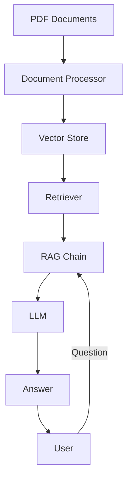

# RAG PDF Chatbot


**A Professional, Enterprise-Grade Retrieval-Augmented Generation System for PDF Documents**

[](https://opensource.org/licenses/MIT)
[](https://www.python.org/downloads/)
[](https://github.com/psf/black)

## 🎯 Problem Statement

Organizations struggle with extracting actionable insights from large collections of PDF documents. Traditional search methods fail to provide contextual, accurate answers to complex questions. RAG PDF Chatbot solves this by combining:

- **Document Retrieval**: Find relevant information from PDF collections
- **Contextual Understanding**: Use LLM to understand and synthesize information
- **Natural Language Interface**: Ask questions in plain English and get precise answers

## 🏗️ Architecture



### Key Components

1. **Document Processor**: Loads and chunks PDF documents
2. **Vector Store**: Stores document embeddings for efficient retrieval
3. **Retriever**: Finds relevant documents for a given question
4. **RAG Chain**: Combines retrieved context with LLM for answer generation
5. **LLM Interface**: Uses Ollama to run local language models

## 🛠️ Tech Stack

- **Core**: Python 3.8+
- **Document Processing**: LangChain, PyMuPDF
- **Embeddings**: Ollama (nomic-embed-text)
- **Vector Store**: FAISS
- **LLM**: Ollama (llama3.2:3b)
- **Configuration**: Python dataclasses + environment variables
- **Testing**: pytest

## 🚀 Quick Start

### Prerequisites

- Python 3.8+
- Ollama running locally with required models
- PDF documents in the `rag-dataset/` directory

### Installation

```bash
# Clone the repository
git clone https://github.com/your-org/rag-pdf-chatbot.git
cd rag-pdf-chatbot

# Create virtual environment (recommended)
python -m venv venv
source venv/bin/activate  # On Windows: venv\Scripts\activate

# Install dependencies
pip install -r requirements.txt

# Set up environment variables
cp .env.example .env
# Edit .env with your configuration
```

### Running the Application

```bash
# Basic usage
python -m src.main --help

# Ask a specific question
python -m src.main --question "What are the benefits of BCAA supplements?"

# Interactive mode
python -m src.main --interactive

# Rebuild vector store
python -m src.main --rebuild --interactive
```

### Running with Docker 🐳

Alternatively, you can build and run the application inside a container using Docker:

```bash
# Build the Docker image
docker build -t rag-pdf-chatbot .

# Run the chatbot interactively
docker run -it rag-pdf-chatbot
```


## 📂 Project Structure

```
rag-pdf-chatbot/
├── src/                  # Core application code
│   ├── __init__.py       # Package initialization
│   ├── config.py         # Configuration management
│   ├── document_processor.py  # Document loading and processing
│   ├── vector_store.py   # Vector storage and retrieval
│   ├── rag_chain.py      # RAG pipeline implementation
│   └── main.py           # Main application entry point
├── tests/                # Unit and integration tests
├── docs/                 # Architecture and design documentation
├── config/               # Configuration files
├── scripts/              # Automation and utility scripts
├── .env.example          # Environment variable template
├── .gitignore            # Git ignore patterns
├── README.md             # This file
└── requirements.txt      # Python dependencies
```

## 🔧 Configuration

The application uses environment variables for configuration. See `.env.example` for all available options:

```env
# Ollama Configuration
OLLAMA_BASE_URL=http://localhost:11434
EMBEDDING_MODEL=nomic-embed-text
LLM_MODEL=llama3.2:3b

# Document Processing
DATASET_PATH=rag-dataset
CHUNK_SIZE=1000
CHUNK_OVERLAP=100

# Vector Store
VECTOR_STORE_PATH=health_supplements
SAVE_VECTOR_STORE=true

# Retrieval
RETRIEVAL_TYPE=mmr
RETRIEVAL_K=3
RETRIEVAL_FETCH_K=100
RETRIEVAL_LAMBDA=1.0
```

## 🧪 Testing

```bash
# Run all tests
pytest tests/

# Run specific test
pytest tests/test_document_processor.py

# Run with coverage
pytest --cov=src tests/
```

## 📖 Documentation

- [Architecture Overview](docs/ARCHITECTURE.md)
- [Contributing Guide](docs/CONTRIBUTING.md)
- [API Reference](docs/API.md)
- [Comprehensive CI/CD Guide](docs/CI_CD_EXPLAINED.md)
- [Ultimate Learning Roadmap & Syllabus](docs/LEARNING.md)

## 🤝 Contributing

We welcome contributions! Please see [CONTRIBUTING.md](docs/CONTRIBUTING.md) for guidelines.

## 📜 License

This project is licensed under the MIT License - see the [LICENSE](LICENSE) file for details.

## 🎯 Value Proposition

**For Developers:**
- Clean, modular architecture following SOLID principles
- Easy to extend and customize
- Comprehensive documentation and examples

**For Organizations:**
- Extract insights from PDF documents efficiently
- Reduce manual document review time
- Improve knowledge discovery and decision making

**For Recruiters:**
- Professional, enterprise-grade codebase
- Follows best practices for security and maintainability
- Demonstrates advanced Python and AI/ML skills

## 🔒 Security

This project follows GitGuardian security standards:
- No hardcoded secrets
- Environment variable configuration
- Secure dependency management
- Regular security audits

## 📞 Support

For issues, questions, or feature requests, please open an issue on GitHub.

---

**Built with ❤️ for developers, by developers.**
