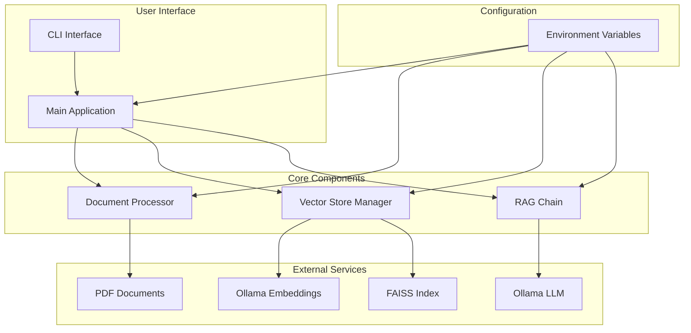
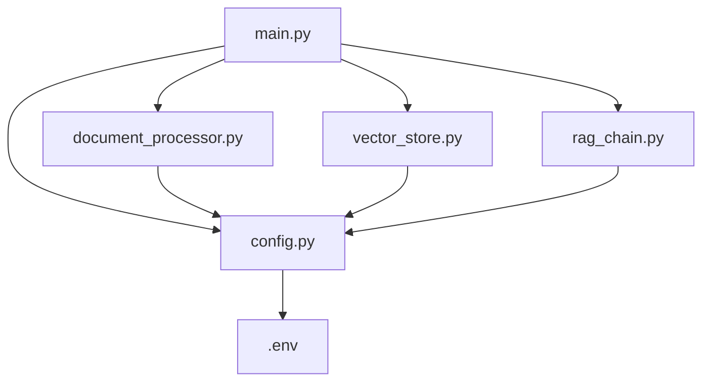

# Architecture Overview

## 🏗️ System Architecture

RAG PDF Chatbot follows a modular, layered architecture designed for scalability, maintainability, and extensibility.

### High-Level Architecture

## 🧩 Component Architecture

### 1. Document Processor

**Responsibilities:**
- Discover PDF files in dataset directory
- Load PDF content using PyMuPDFLoader
- Split documents into chunks for embedding
- Handle document processing errors gracefully

**Key Features:**
- Configurable chunk size and overlap
- Error handling and warnings
- Support for nested directory structures
- PDF-specific processing

### 2. Vector Store Manager

**Responsibilities:**
- Initialize embedding models
- Create and manage FAISS vector stores
- Handle vector store persistence
- Provide document retrieval capabilities

**Key Features:**
- Support for multiple distance metrics (L2, IP)
- Automatic dimension detection
- Local storage and loading
- Configurable retrieval parameters

### 3. RAG Chain

**Responsibilities:**
- Initialize LLM models
- Create prompt templates
- Build RAG pipeline
- Handle question answering

**Key Features:**
- Fallback to custom prompts if hub fails
- Configurable LLM parameters
- Document formatting for context
- Error handling and validation

### 4. Main Application

**Responsibilities:**
- Orchestrate the RAG pipeline
- Provide CLI interface
- Handle application lifecycle
- Manage vector store caching

**Key Features:**
- Multiple operation modes (single question, interactive)
- Vector store caching and rebuilding
- Command-line argument parsing
- Interactive session management

## 🔧 Design Patterns

### SOLID Principles

1. **Single Responsibility Principle**
   - Each module has a single, well-defined responsibility
   - Clear separation of concerns between components

2. **Open/Closed Principle**
   - Components are open for extension but closed for modification
   - Configuration-driven behavior allows easy customization

3. **Liskov Substitution Principle**
   - Interfaces are designed for substitutability
   - Components can be replaced with alternative implementations

4. **Interface Segregation Principle**
   - Small, focused interfaces
   - Clients only depend on what they need

5. **Dependency Inversion Principle**
   - High-level modules depend on abstractions
   - Configuration and dependencies are injected

### Other Patterns

- **Factory Pattern**: Configuration loading and initialization
- **Strategy Pattern**: Different retrieval strategies
- **Facade Pattern**: Main application as facade for complex pipeline
- **Repository Pattern**: Vector store as document repository

## 📦 Module Dependencies

## 🔄 Data Flow

1. **Initialization Phase**
   - Load configuration from environment variables
   - Initialize document processor with config
   - Initialize vector store manager with config
   - Check for existing vector store or build new one

2. **Question Answering Phase**
   - User provides question via CLI
   - Retriever finds relevant documents from vector store
   - RAG chain formats context and question
   - LLM generates answer using prompt template
   - Answer is returned to user

3. **Persistence Phase**
   - Vector store is saved to disk (if configured)
   - Configuration remains in memory for session
   - Application state is maintained for interactive sessions

## 🎯 Performance Considerations

- **Vector Store**: FAISS provides efficient similarity search
- **Chunking**: Optimal chunk size balances context and performance
- **Caching**: Vector store persistence avoids reprocessing
- **Batch Processing**: Documents processed in batches for efficiency

## 🛡️ Security Architecture

- **Configuration**: All sensitive data via environment variables
- **Validation**: Input validation at all levels
- **Error Handling**: Graceful degradation and meaningful errors
- **Dependencies**: Regular security updates and audits

## 🔮 Future Architecture Evolution

- **Microservices**: Potential to split components into services
- **API Layer**: REST/GraphQL interface for programmatic access
- **Plugin System**: Extensible architecture for custom components
- **Distributed Processing**: Support for large-scale document processing

## 📚 References

- Clean Architecture by Robert C. Martin
- Design Patterns: Elements of Reusable Object-Oriented Software
- Domain-Driven Design by Eric Evans
- SOLID Principles of Object-Oriented Design
